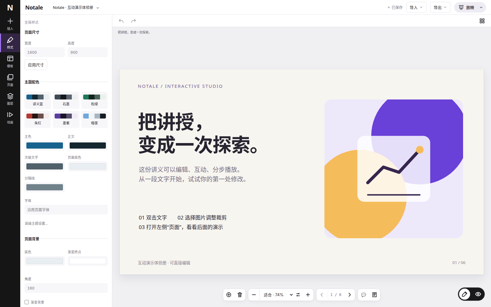

# Notale

**面向讲授的互动演示编辑器，具备设计工具的编辑深度。**

用熟悉的页面、图层和属性面板制作互动讲义，在同一个工程中完成编辑、页内步骤、放映和演讲者备注。



## 能做什么

- 编辑文字、图片、形状、连接线、SVG、表格与图表，支持多选、排列、快捷键和撤销重做。
- 插入原创整页模板和独立图示，编辑原生对象并保存互动组件参数。
- 编排页内动画和讲授步骤，在放映与演讲者视图中使用备注、计时和标注。
- 自动保存编辑与讲稿，保留本机恢复草稿，处理保存冲突并恢复历史版本。
- 导入导出工程与 HTML 讲义；导出产物保留受支持的互动运行时。

具体接通范围与限制见[集成覆盖说明](notale-editor-frontend/docs/INTEGRATION-COVERAGE.md)。复杂内容采用对应编辑适配器，任意 HTML 中的所有脚本、Canvas 或 CSS 效果并不都会自动变为可视化属性。

## 本地运行

需要 Node.js 20.19+、npm，以及可运行 Docker Compose 的环境。默认只在本机监听。

```bash
cd notale-editor
npm ci
docker compose up -d --wait
npm run build
cd ../notale-editor-frontend
npm ci
npm run build
npm run start:local
```

打开 **http://localhost:4312**。前端默认使用 4312，后端 API 使用 4310，隔离内容服务使用 4311；本机端口转发只需转发 4312。

[完整部署说明](notale-editor-frontend/docs/LOCAL-DEPLOYMENT.md)包含端口配置、数据库、进程管理与主系统身份接入。此本地启动方式使用开发上下文；对外托管需接入主系统身份、授权和独立内容源。

## 项目结构

```text
notale-editor/           TypeScript 后端、文档协议与讲义运行时
notale-editor-frontend/  Next.js App Router、React、TypeScript 编辑器
```

两个应用独立安装与构建。前端使用版本锁定的后端公开契约归档，通过 HTTP 保存文档；升级契约使用前端的 `npm run contract:update`。

- [前端开发](notale-editor-frontend/README.md)
- [后端与集成 API](notale-editor/README.md)
- [编辑器架构](notale-editor-frontend/docs/EDITOR-ARCHITECTURE.md)
- [放映与演讲者视图](notale-editor-frontend/docs/PRESENTATION.md)
- [原创模板](notale-editor-frontend/templates/original/README.md)

日常验证选择本次改动涉及的用例；生产发布需完成构建和关键编辑链路验证。浏览器验证先安装 Playwright Chromium，或设置 `CHROMIUM_PATH` 使用现有浏览器。

## 许可

Notale 自有编辑器代码和原创模板使用 MIT。第三方代码与依赖遵循各自许可，见[第三方通知](notale-editor-frontend/docs/release/THIRD-PARTY-NOTICES.txt)及[许可范围说明](notale-editor-frontend/docs/release/LICENSE-SCOPE.md)。用户导入的讲义和媒体不因使用本软件而改变所有权或许可。
