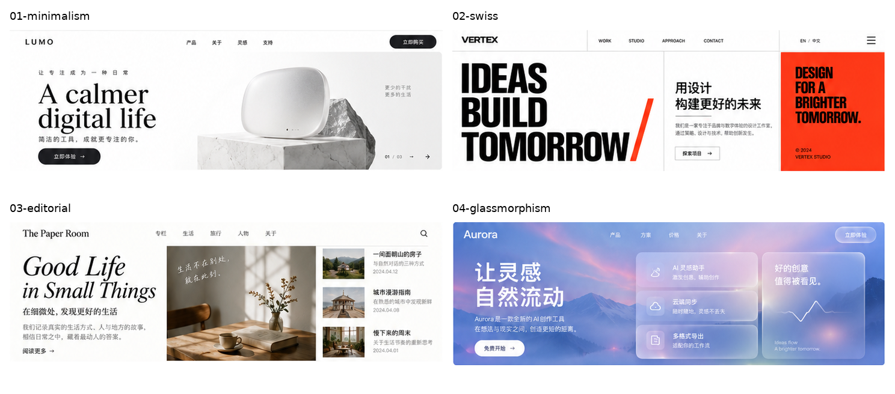
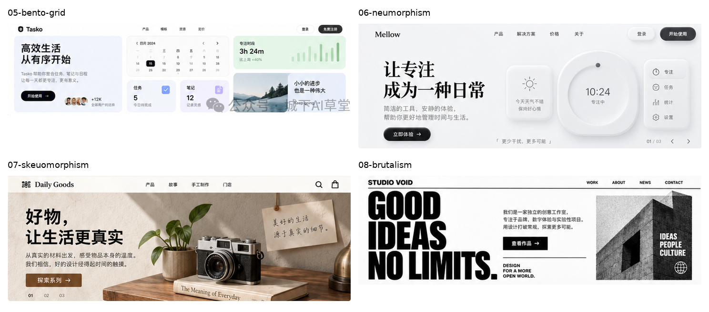
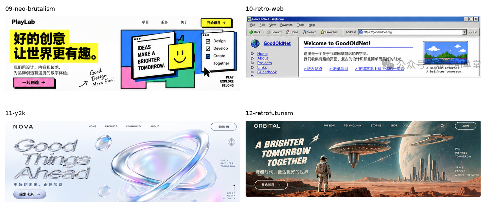
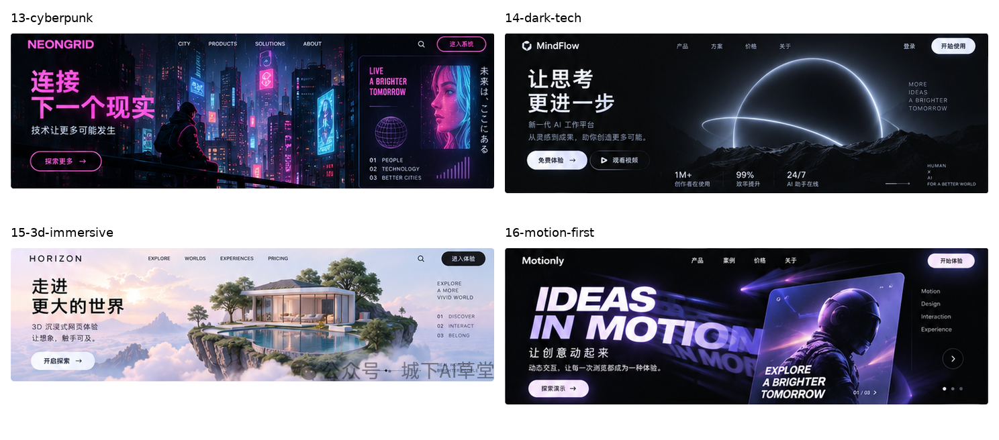
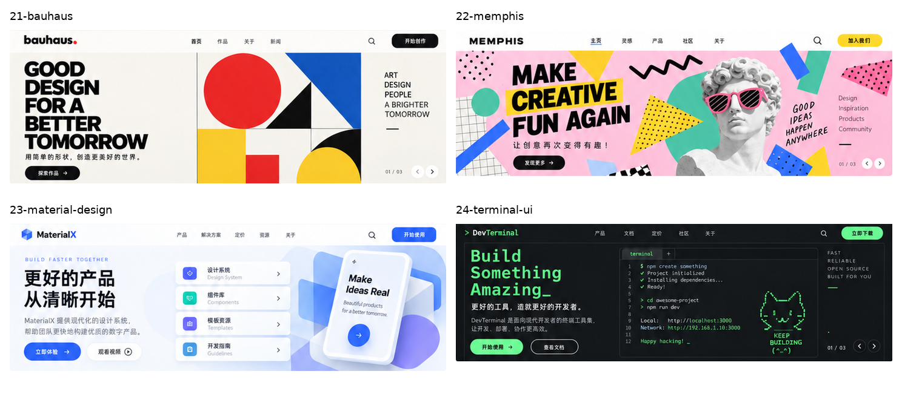
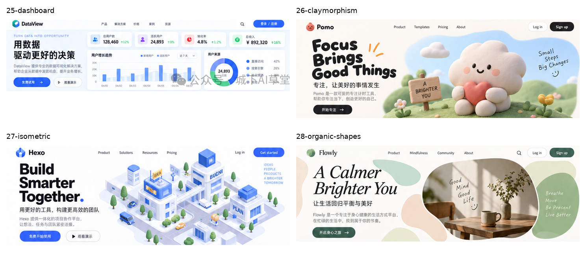
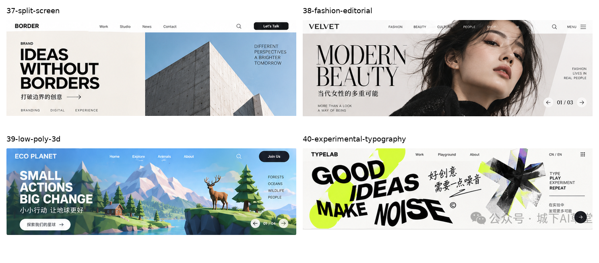

# Compact style references

40 style IDs; 40 unique pixel images. Only pixel-identical crops are merged; all IDs and source crops remain.

Generated by `python3 references/styles/crop.py --contacts-only`. Each sheet has at most four images. This index lists the current sheets; older unlisted files, if any, are not part of this set.

## 01 · 01-minimalism, 02-swiss, 03-editorial, 04-glassmorphism

[Open sheet](01.png) · [01-minimalism](../shots/01-minimalism.png) · [02-swiss](../shots/02-swiss.png) · [03-editorial](../shots/03-editorial.png) · [04-glassmorphism](../shots/04-glassmorphism.png)

## 02 · 05-bento-grid, 06-neumorphism, 07-skeuomorphism, 08-brutalism

[Open sheet](02.png) · [05-bento-grid](../shots/05-bento-grid.png) · [06-neumorphism](../shots/06-neumorphism.png) · [07-skeuomorphism](../shots/07-skeuomorphism.png) · [08-brutalism](../shots/08-brutalism.png)

## 03 · 09-neo-brutalism, 10-retro-web, 11-y2k, 12-retrofuturism

[Open sheet](03.png) · [09-neo-brutalism](../shots/09-neo-brutalism.png) · [10-retro-web](../shots/10-retro-web.png) · [11-y2k](../shots/11-y2k.png) · [12-retrofuturism](../shots/12-retrofuturism.png)

## 04 · 13-cyberpunk, 14-dark-tech, 15-3d-immersive, 16-motion-first

[Open sheet](04.png) · [13-cyberpunk](../shots/13-cyberpunk.png) · [14-dark-tech](../shots/14-dark-tech.png) · [15-3d-immersive](../shots/15-3d-immersive.png) · [16-motion-first](../shots/16-motion-first.png)

## 05 · 17-maximalism, 18-collage, 19-hand-drawn, 20-pixel

[Open sheet](05.png) · [17-maximalism](../shots/17-maximalism.png) · [18-collage](../shots/18-collage.png) · [19-hand-drawn](../shots/19-hand-drawn.png) · [20-pixel](../shots/20-pixel.png)

## 06 · 21-bauhaus, 22-memphis, 23-material-design, 24-terminal-ui

[Open sheet](06.png) · [21-bauhaus](../shots/21-bauhaus.png) · [22-memphis](../shots/22-memphis.png) · [23-material-design](../shots/23-material-design.png) · [24-terminal-ui](../shots/24-terminal-ui.png)

## 07 · 25-dashboard, 26-claymorphism, 27-isometric, 28-organic-shapes

[Open sheet](07.png) · [25-dashboard](../shots/25-dashboard.png) · [26-claymorphism](../shots/26-claymorphism.png) · [27-isometric](../shots/27-isometric.png) · [28-organic-shapes](../shots/28-organic-shapes.png)

## 08 · 29-gradient-mesh, 30-monoline-illustration, 31-luxury-minimal, 32-japandi

[Open sheet](08.png) · [29-gradient-mesh](../shots/29-gradient-mesh.png) · [30-monoline-illustration](../shots/30-monoline-illustration.png) · [31-luxury-minimal](../shots/31-luxury-minimal.png) · [32-japandi](../shots/32-japandi.png)

## 09 · 33-eco-nature, 34-monochrome-photography, 35-abstract-geometry, 36-scrollytelling

[Open sheet](09.png) · [33-eco-nature](../shots/33-eco-nature.png) · [34-monochrome-photography](../shots/34-monochrome-photography.png) · [35-abstract-geometry](../shots/35-abstract-geometry.png) · [36-scrollytelling](../shots/36-scrollytelling.png)

## 10 · 37-split-screen, 38-fashion-editorial, 39-low-poly-3d, 40-experimental-typography

[Open sheet](10.png) · [37-split-screen](../shots/37-split-screen.png) · [38-fashion-editorial](../shots/38-fashion-editorial.png) · [39-low-poly-3d](../shots/39-low-poly-3d.png) · [40-experimental-typography](../shots/40-experimental-typography.png)

