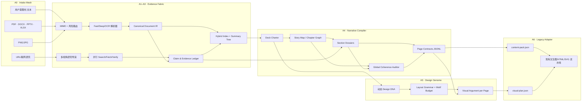
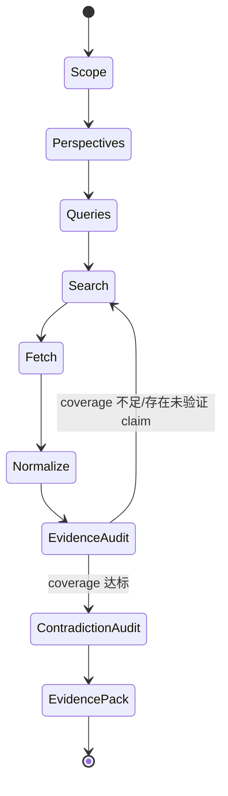

# RFC：Atlas 证据驱动的长讲义规划编译器

状态：Proposed · Creative subsystem revision 2  
目标版本：Workflow V2 planning layer  
依赖调研：[planning-layer-research-2026-08-01.md](planning-layer-research-2026-08-01.md)

A5–A6 的规范性创意运行设计见 [Creative Autonomy Runtime V2](planning-layer-creative-autonomy-v2.md)。该 RFC 取代 agent-native 路径中的固定 `pageType → layoutBank → zones → hierarchy` 假设；本文件中与之冲突的 legacy 描述仅适用于 `planningMode: legacy-layout`。

## 1. 设计目标

Atlas 将“用户意图 + 本地长材料 + 联网研究”编译为可追踪的长讲义页面合同，再交给现有文生图、HTML/SVG 与真机验收流水线。

必须支持：

- PDF、DOCX、PPTX、XLSX、Markdown、HTML、TXT、PNG/JPG，后续可扩展 ZIP/音视频。
- 单份超长材料、多材料混合、用户粘贴长文本和 URL。
- 快速搜索与深度研究两档，允许限定域名、时间范围、语言和来源类型。
- 60–70 页乃至更长输出，不依赖一次超长模型调用。
- 每个页面 claim 能定位到 URL/文件、页码/幻灯片、段落或 bbox。
- 章节级并行、断点续跑、内容哈希缓存、定点重做和完整日志。
- 动态生成 deck-level design DNA，不把风格限制在七个 preset。

非目标：

- 首版不替换现有图像生成、HTML 拟合和浏览器探针。
- 首版不把所有企业数据源都做成内置连接器；通过 provider/MCP 扩展。
- 首版不部署完整知识图谱数据库；先使用文件化 claim/entity graph。

## 2. 核心原则

1. **Evidence before slides**：先建立证据，再写页面。
2. **Hierarchy over giant context**：上下文按 corpus/document/section/block/page 分层，不做巨型 prompt。
3. **Contracts over prose**：阶段之间传 JSON Schema 合同，不传不受控长文。
4. **Stable core, elastic design genome**：只冻结跨页识别所需的最小视觉核心；章节调制与页面构图保持开放，设计 Agent 可以提出语法之外的新方案。
5. **Incremental materialization**：大纲、章节、页面逐层物化，70 页不是一次输出。
6. **Local-first, provider-open**：原文件、解析、索引、缓存和规划产物默认本地；搜索/模型可替换。
7. **Untrusted by default**：网页和上传材料只是数据，不得修改系统指令或调用权限。
8. **Observable and resumable**：每个步骤有 run id、输入输出哈希、耗时、token、缓存命中和 lineage。

## 3. 总体架构



## 4. A0：Intake Mesh

统一输入描述，不让 `materials` 只是字符串数组：

```json
{
  "id": "source-0001",
  "kind": "file",
  "uri": "materials/annual-report.pdf",
  "declaredMime": "application/pdf",
  "role": "primary-evidence",
  "trust": "user-provided",
  "languageHints": ["zh-CN", "en"],
  "permissions": { "allowNetwork": false },
  "sha256": "..."
}
```

输入种类：

- `file`：本地文件。
- `text`：用户粘贴长文本，原文保存为内容寻址 blob。
- `url`：用户指定网页。
- `research-query`：需要系统主动搜索的研究任务。
- `collection`：目录、ZIP 或一组来源的逻辑容器。

路由前完成：文件签名/MIME 检查、大小/页数预算、恶意压缩包与路径穿越防护、宏/脚本隔离、来源角色和信任等级标记。

## 5. A1：多通道解析与 Canonical Document IR

### 5.1 解析路由

| 输入 | fast path | deep path | fallback |
|---|---|---|---|
| Markdown/HTML/TXT/CSV/JSON | 内置解析 | — | MarkItDown |
| DOCX/PPTX/XLSX | MarkItDown | Docling | 转 PDF 后 Docling/PaddleOCR 复验视觉内容 |
| 数字 PDF | Docling quick | Docling full layout | Marker/PaddleOCR A/B |
| 扫描 PDF/PNG/JPG | — | PaddleOCR PP-StructureV3 | Docling OCR/VLM 或经过许可审查的 MinerU |
| 未知/长尾格式 | Apache Tika 探测/文本 | 格式专用 adapter | 拒绝并给出可转换建议 |

路由依据不是扩展名，而是 MIME、文本层质量、图像覆盖率、表格/公式/多栏概率和 OCR 置信度。fast path 的结果低于质量阈值时自动升级，不要求用户重试。

### 5.2 Document IR

IR 必须同时保存语义树与几何定位：

```json
{
  "documentId": "doc-...",
  "sourceId": "source-0001",
  "format": "pdf",
  "title": "...",
  "nodes": [
    {
      "id": "n-...",
      "type": "heading|paragraph|list|table|figure|formula|note|slide",
      "parentId": "n-parent",
      "order": 17,
      "text": "...",
      "page": 12,
      "bbox": [0.11, 0.23, 0.78, 0.34],
      "assetRef": "blob:sha256:...",
      "confidence": 0.97,
      "parser": { "name": "docling", "version": "..." }
    }
  ]
}
```

表格必须保留单元格、行列和合并关系；PPTX 必须保留 slide number、speaker notes、shape text、图片和可用的 reading order；图片必须同时保存 OCR block 与视觉描述，但视觉描述不能冒充原文。

## 6. A2：Evidence Fabric

### 6.1 多种检索视图

同一 Document IR 建立四种视图：

- lexical：BM25/FTS，擅长专有名词、数字和精确措辞。
- semantic：dense embeddings，擅长同义表达。
- structural：heading path、document、page、table、figure、notes。
- graph：entity、relationship、claim、contradiction 和 prerequisite。

检索采用 hybrid recall → metadata filter → rerank → diversity selection，不直接把 top-k 向量块视为最终证据。

### 6.2 摘要树

每个文档生成：

`block → section → chapter/document → corpus theme`

上层摘要必须保存由哪些下层节点派生，不能丢失 lineage。全局规划读取 document/corpus 层；页面写作读取 section/block 层，并可回溯原文。

### 6.3 Claim & Evidence Ledger

```json
{
  "claimId": "claim-...",
  "text": "...",
  "status": "supported|disputed|unsupported|inferred",
  "evidence": [
    {
      "sourceId": "source-0001",
      "nodeId": "n-...",
      "quote": "不超过必要长度的证据片段",
      "locator": { "page": 12, "bbox": [0.11, 0.23, 0.78, 0.34] },
      "url": null,
      "retrievedAt": null,
      "contentHash": "...",
      "support": 0.94,
      "authority": 0.88,
      "freshness": 1.0
    }
  ],
  "counterEvidence": []
}
```

关键数字、结论、定义、因果关系和时间敏感事实必须是原子 claim；“参考资料大概支持”不算通过。

## 7. A3：联网 Research Director

### 7.1 两种模式

- `quick`：2–4 个查询，优先官方来源，目标是补充缺口或验证事实。
- `deep`：4–8 个视角，每个视角包含 discovery、verification 和 counterevidence 查询，可动态扩展。

### 7.2 研究状态机



查询任务至少包含：主题、问题、期望来源类型、语言、时间范围、地域、禁止域名、验证对象和停止预算。搜索结果页面中的任何指令均作为不可信文本处理；研究 agent 无写文件外的外部副作用权限。

### 7.3 来源评分

评分用于排序和审计，不用于自动宣布真伪：

`score = relevance × authority × freshness × directness × diversity - duplication - conflictRisk`

- authority：官方文档、原始论文、监管/标准组织优先。
- directness：原始数据/论文优于转述。
- freshness：仅对时间敏感 claim 加权。
- diversity：防止多个结果实际来自同一稿源。
- conflictRisk：已知矛盾或引用链断裂时降权并进入人工/模型复核。

### 7.4 搜索 provider 合同

```ts
interface SearchProvider {
  search(query: SearchQuery): Promise<SearchHit[]>;
  fetch(hit: SearchHit): Promise<FetchedDocument>;
}
```

Exa/Tavily/Brave/Google/本地代理都只实现该合同。provider 返回的摘要只能用于 discovery；关键 claim 必须基于抓取后的正文或可验证原始页面。

## 8. A4：Narrative Compiler

### 8.1 四级编译产物

1. `deck-charter.json`
   - audience、场景、时长、学习/决策目标、已有知识、语气、页数范围、证据规则、不可编造项。
2. `story-map.json`
   - 章节图、叙事弧、先修关系、高潮/转折、章节页数预算和 coverage quota。
3. `sections/<id>.json`
   - 每章论点、证据包、页面角色序列、过渡句、待解决问题。
4. `pages/<id>.json`
   - 单页 message、claims、evidence ids、visual argument、speaker notes、quality checklist。

### 8.2 70 页生成策略

禁止一次调用生成全部页面。建议默认：

- 先产生 6–10 个章节的 story map。
- 每章规划 5–12 页，单独生成并校验。
- 章节可以并行，但每章只读 deck charter、story map、自己的 dossier 和相邻章节摘要。
- 页面写入独立 JSON 或 append-only JSONL，每生成一页即校验和 checkpoint。
- 全部章节完成后执行 global coherence pass，只输出 patch，不重写整套页面。

全局审计检查：

- 同一 claim 是否冲突或跨页措辞漂移。
- 是否存在重复页、信息空洞页或章节失衡。
- 概念是否在使用前定义。
- 章节开头/结尾与过渡是否完成叙事职责。
- 每个关键目标是否有足够页面与证据覆盖。
- 每页信息密度是否符合受众和时长，而不是机械“高密度”。

### 8.3 Page Contract

```json
{
  "id": "page-023",
  "chapterId": "ch-04",
  "role": "explain-mechanism",
  "title": "...",
  "message": "观众离开这一页时只需记住的一句话",
  "claims": ["claim-0012", "claim-0088"],
  "evidencePacket": ["evidence-..."],
  "contentBudget": { "headline": 1, "supportingPoints": 4, "metrics": 2 },
  "visualArgument": {
    "relationship": "causal-flow",
    "requiredEntities": ["..."],
    "requiredRelations": ["..."],
    "prohibitedFabrications": ["..."]
  },
  "designAutonomy": {
    "level": "high",
    "openDimensions": ["composition", "metaphor", "spatial-system", "depth", "rhythm"],
    "mayBreakLayoutGrammar": true,
    "candidateCount": 1
  },
  "speakerNotes": "...",
  "transition": { "from": "...", "to": "..." },
  "checks": ["claim-grounded", "audience-fit", "not-duplicate"]
}
```

现有 `content-pack.json` 由 page contracts 编译得到，而不是成为最早的规划产物。

## 9. A5：Design Genome

Design Genome 与 deck charter、story map 同时推导。它不是模板、风格枚举或页面坐标表，而是“最小识别核心 + 可变设计轴 + 逃生口”：

```json
{
  "name": "动态生成的风格名称",
  "rationale": "为何适合该主题、受众与场景",
  "identityCore": {
    "paletteLogic": "颜色角色与对比关系，不要求每页机械使用相同色块",
    "typographicVoice": "字形气质和层级原则",
    "graphicDNA": "线条、边缘、图标或图像的共同语言",
    "recurringMotifs": ["最多 1–3 个弱母题"]
  },
  "elasticAxes": {
    "composition": "open",
    "metaphor": "open",
    "spatialSystem": "open",
    "depth": "chapter-variable",
    "density": "page-role-variable",
    "imageToTypeRatio": "page-role-variable"
  },
  "chapterMutations": ["允许章节形成有理由的局部调制"],
  "layoutGrammar": {
    "principles": ["生成原则而非版式 ID 列表"],
    "suggestedPrimitives": ["可选，不是必须使用"],
    "escapeHatch": "只要语义、可读性和跨页身份闸通过，可以完全不用建议原语"
  },
  "avoid": ["..."],
  "seedreamBrief": "..."
}
```

七个已有 preset 的角色：

- 作为回归测试和 A/B benchmark。
- 作为用户明确指定时的快捷起点。
- 作为动态风格生成器的 few-shot 质量锚点。

它们不能成为枚举约束。默认流程先生成 2–3 个彼此有实质差异的 deck-level art direction，由内容适配、原创性、可执行性和可读性评审选出一个；不是从七个 preset 里投票。

选中后只锁定 `identityCore`。`elasticAxes`、章节调制、页面隐喻和具体构图继续由设计 Agent 决定。关键封面、章节转折、核心架构页可把 `candidateCount` 提升为 2–3；普通页面默认单候选，以控制时间和风格漂移。

### 9.1 Creative Autonomy Contract

所有视觉指令必须分成三类，禁止混写：

| 类别 | 例子 | 执行强度 |
|---|---|---|
| Semantic locks | 精确文字、数字、节点、关系、来源、不得编造项 | 硬约束，失败即拒绝 |
| Identity core | 色彩角色、字体气质、图形 DNA、品牌规则 | 跨页一致性约束，允许章节级有理由调制 |
| Design hypotheses | hero 建议、构图方向、隐喻、布局原语、密度建议 | 软约束，Agent 可以推翻并说明设计理由 |

设计 Agent 的输出不是“填模板”，而是一个 `design-proposal.json`：

```json
{
  "pageId": "page-023",
  "thesis": "该页的视觉论证",
  "composition": "Agent 自主提出的空间系统",
  "metaphor": "可为空，也可原创",
  "readingPath": ["..."],
  "identityUsage": ["本页如何保持 deck 身份"],
  "grammarDeviations": ["偏离建议语法的地方与理由"],
  "riskChecks": ["文字密度", "连接线复杂度", "图像模型文字风险"]
}
```

评审只检查结果是否正确、清楚、有身份、非重复和可执行，不检查它是否服从某个模板或与参考页像素相似。

### 9.2 稳定性来自哪里

稳定性不能靠固定版式取得，而应来自：

- typed semantic contracts 和精确 evidence lineage；
- 设计前的输入完整性检查；
- 真实渲染后的可读性、溢出、连线、文字与视觉评审；
- 最小身份核心和跨页重复/漂移检测；
- 有界候选数、重试预算、checkpoint 与定点 patch。

这样稳定的是“输出正确且可用”，不是“每次长得一样”。

## 10. A6：兼容现有流水线

新增规划目录建议：

```text
run/
  input/source-manifest.json
  blobs/sha256/...
  documents/<doc-id>.jsonl
  research/research-plan.json
  research/search-events.jsonl
  evidence/ledger.jsonl
  index/manifest.json
  planning/deck-charter.json
  planning/story-map.json
  planning/sections/*.json
  planning/pages/*.json
  planning/design-genome.json
  planning/checkpoints.jsonl
  content-pack.json
  visual-plan.json
```

兼容层把 page contract 映射到当前 page：

- `title` → `page.title`
- `message` → `page.purpose`
- claim text + evidence source → `page.claims[]`
- speaker notes 保留
- graph/series/code 从结构化证据中提取
- visual argument 进入新的 visual planning 输入，不污染 content-pack 的呈现边界

但兼容不等于继续服从当前有限版式。现有 `visual-plan.mjs` 的 `pageType → selectLayout(layoutBank)`、必填 `zones` 和固定四级 hierarchy 只能作为 `planningMode: legacy-layout` 路径。必须新增：

- `planningMode: agent-native`：不调用 `selectLayout()`，不要求版式 ID。
- `layoutBlueprint: null` 合法；由 design proposal 直接描述空间系统。
- `zones` 可由 Agent 动态生成，也可以在非分区式构图中省略。
- hierarchy 由页面论证产生，不默认固定为 `message/hero/evidence/takeaway`。
- prompt compiler 把 design hypotheses 标记为可推翻建议，不把它们写成硬命令。

在这条 agent-native 路径实现以前，RFC 只能保证“上游设计开放”，不能保证最终出图仍然开放。

## 11. 持久化、并发与恢复

每个步骤使用：

`cacheKey = hash(stepVersion + normalizedInput + model/providerConfig)`

规则：

- 解析、抓取、embedding、摘要和章节规划都可缓存。
- URL 快照带 `retrievedAt`、ETag/Last-Modified（若有）和正文 hash。
- 并发限额按资源池分开：search、fetch、OCR、LLM、image generation。
- 每个 side effect 必须幂等；重试不能生成重复 page id 或覆盖无关 checkpoint。
- 首版可用本地 SQLite + JSONL + content-addressed blobs；无需先上向量数据库和工作流集群。
- 当出现多机、多人队列和长时间任务后，再评估 Temporal；若需要模型驱动循环和人工中断，可评估 LangGraph。

## 12. 可观测性

把现有 `experiment-log.jsonl` 扩展为 OpenTelemetry 风格 span：

- `run.id`, `trace.id`, `span.id`, `parent.span.id`
- `stage`, `step.version`, `status`
- `source.id`, `document.id`, `query.id`, `claim.id`, `chapter.id`, `page.id`
- `provider`, `model`, `input.tokens`, `output.tokens`, `cost`
- `duration.ms`, `queue.ms`, `retry.count`, `cache.hit`
- `input.hash`, `output.hash`
- `quality.coverage`, `quality.groundedness`, `quality.contradictions`

日志中不写 API key、完整隐私材料或无必要的整页网页正文。

## 13. 质量闸

### 解析闸

- 页/幻灯片数量一致。
- reading order 合理。
- 标题、正文、表格、图、公式和 notes 的覆盖率。
- OCR 低置信 block 有标记，不能静默当成真值。

### 研究闸

- 关键 claim 支持率。
- primary/official source ratio。
- citation locator 可打开或可定位。
- contradictory claims 已标记并处理。
- 时间敏感 claim 的 freshness。
- 搜索结果近重复率和域名集中度。

### 叙事闸

- 目标 coverage。
- audience fit。
- 章节/页面重复率。
- prerequisite violation。
- 章节页数偏差。
- 每页 single-message 清晰度。

### 长输出闸

- 70 页全部有唯一 ID、chapter、claim 和 transition。
- 随机停止后可从最近 checkpoint 恢复。
- 修改一份来源只重算受影响的 claim/section/page。
- global audit 以 patch 修订，不发生整套无差别重写。

## 14. 性能目标（需通过基准校准）

这些是工程目标，不是当前能力声明：

- quick research：首批有用来源的 time-to-first-evidence 可观测并尽量控制在秒级。
- deep research：查询并行，fetch 与 parse 流水化；不能等全部网页结束才开始取证。
- parsing：大文件流式产出 document nodes，支持 time-to-first-block。
- planning：首个 deck charter/story map 优先返回；章节并行，页面增量落盘。
- 任一模型调用不负责超过 12 页的完整 page contracts。
- 任一失败只重做最小受影响单元。

## 15. 分阶段实施路线

### Phase 0：基准与合同

- 建 24 任务本地基准集。
- 定义 source manifest、Document IR、evidence ledger、deck charter、story map、page contract schema。
- 为现有 20 页项目制作 golden contracts。

### Phase 1：本地异构摄入

- 实现 input router、content-addressed blob store、MarkItDown fast path、Docling worker。
- 接 PaddleOCR fallback。
- 输出统一 Document IR 和 parse report。

### Phase 2：联网 Evidence Fabric

- 实现 SearchProvider/FetchProvider。
- query planner、并行检索、去重、来源评分、claim/evidence ledger。
- 加入 quick/deep 两档和引用核验。

### Phase 3：长讲义 Narrative Compiler

- 实现四级编译和章节检查点。
- 加入 summary tree、evidence packet、global coherence auditor。
- 先在 20 页回归，再跑 70 页混合输入实验。

### Phase 4：Design Genome 与下游接入

- 动态生成 style system。
- 实现 Creative Autonomy Contract 与 `design-proposal.json`。
- 在 visual planner/prompt compiler 增加 `agent-native` 路径，绕开固定 layout bank、zones 和四级 hierarchy。
- 将 page contract + design genome 编译到现有 content-pack/visual-plan。
- 七 preset 保留为 benchmark，不进入默认选择约束。

### Phase 5：生产化

- SQLite/FTS/dense index 优化。
- OpenTelemetry trace 与成本/延迟仪表。
- 评估 LangGraph/Temporal、远程队列和多用户隔离。

## 16. 验收场景

最终规划层至少通过：

1. 上传 300 页中文教材 PDF + 70 页旧 PPTX + 10 张流程图 PNG，并给出一个需要补充 2026 年资料的研究题。
2. 系统在本地解析全部文件，显示低置信区域和材料清单。
3. 联网研究返回研究计划、来源覆盖和可核验 claim ledger。
4. 生成 60–70 页 story map、section dossiers 和逐页 contracts。
5. 任意终止后可以恢复；修改一个来源只失效受影响产物。
6. 抽查关键页可从 claim 回到 URL/文件页码/bbox。
7. 设计风格由该任务动态推导，全 deck 一致但页面构图不僵化。
8. 编译到现有 `content-pack.json` 和 `visual-plan.json` 后，下游无需感知原始材料规模。

## 17. 需求追踪与设计验证

| 用户要求 | 负责阶段 | 明确产物/机制 | 验证方式 | 设计状态 |
|---|---|---|---|---|
| 准确、快速的联网搜索 | A3 | quick/deep 模式、并行 query、正文 fetch、来源评分、claim ledger | time-to-first-evidence、搜索 coverage、引用支持率、域名集中度 | 已覆盖 |
| 联网结果可进入后续规划 | A2–A4 | 网页同样进入 Document IR、evidence ledger 和 evidence packet | 页面 claim 反向定位 URL/正文 span | 已覆盖 |
| 用户上传长段内容 | A0–A1 | text source → content-addressed blob → Document IR | 百万字符输入的流式解析和恢复测试 | 已覆盖 |
| PDF/DOCX/PPTX/PNG 多格式 | A1 | fast/deep/OCR router 与 canonical Document IR | 24 任务基准，按格式检查结构与几何定位 | 已覆盖 |
| 长上下文理解 | A2 | hybrid index、结构视图、摘要树、claim graph | LongBench/RULER 风格检索与多跳问题；中部信息压力测试 | 已覆盖 |
| 60–70 页长输出 | A4 | 四级编译、5–12 页 section shard、pages 独立落盘 | 70 页唯一性、完整性、章节一致性和故障恢复 | 已覆盖 |
| 输出要快 | A1/A3/A4 | 流式解析、查询/章节并行、缓存、最小重算 | 各阶段 p50/p95、cache hit、critical path | 已覆盖，阈值待基准校准 |
| 规划要 fancy、不死板 | A4–A5 | story map、Creative Autonomy Contract、弹性 Design Genome、agent-native design proposal | 跨主题原创风格评测；构图重复率与 deck 一致性同时检查 | 设计已覆盖，下游 agent-native 待实现 |
| 七风格不能限制模型 | A5 | presets 仅作 benchmark/few-shot/显式快捷选项 | 默认无 preset 时能产出 schema 合法的新 design genome | 已覆盖 |
| 兼容现有文生图/HTML 链路 | A6 | page contracts → content-pack/visual-plan adapter | 对现有 20 页项目做 golden diff 与全链路回归 | 已覆盖，适配器待实现 |
| 详细日志、可恢复 | 全阶段 | hash cache、checkpoint JSONL、OTel-style spans | 任意阶段 kill/resume、单来源修改的影响面测试 | 已覆盖 |
| 本地优先且不降低质量 | A0–A2 | 原文件/解析/索引/规划本地；深解析与 OCR 分级而非降级 | 离线解析基准与联网 provider 断开测试 | 已覆盖 |
| 安全处理网页/上传材料 | A0/A3 | trust label、指令/数据隔离、预算和最小权限 | prompt injection、路径穿越、压缩炸弹、无界搜索测试 | 已覆盖 |

### 17.1 现有 20 页回归映射

当前 `data-structures-20` 示例包含 20 页、5 个 graph 页、3 个 series 页、2 个 code 页和 2 个含 speaker notes 的页面。兼容适配器必须保证这些结构在新规划层中不丢失：

- graph nodes/edges 由结构化 claim/关系直接编译，不能从视觉图反推。
- series 的 label/value 保持原始类型和证据引用。
- code source 保持逐字真值，并保留来源定位。
- speaker notes 从 page contract 传入 content-pack。
- 现有页面 ID 可作为 stable id；章节信息新增在上游合同，不要求旧渲染器立即理解。

### 17.2 70 页纸面演练

假设 story map 生成 8 章，页数预算为 `6 + 9 + 10 + 8 + 10 + 9 + 10 + 8 = 70`：

- 全局调用只生成 8 章的职责、顺序、预算和 coverage quota，不生成 70 页正文。
- 8 个 section planner 各自只负责 6–10 页，低于“单次不超过 12 页合同”的上限。
- 每章读取全局 charter/story map、自己的 evidence dossier、前后章摘要；不读取另外 60 多页全文。
- 每个 page contract 校验后立即落盘；第 53 页失败不会使 1–52 页失效。
- global coherence auditor 只产生 page/section patch，例如移动、合并、补证据或改 transition；不能无理由重写 70 页。
- 下游继续逐页生成，可按章节/资源池并发，并保持现有构图 ledger 的有序更新策略。

### 17.3 尚未验证的风险

RFC 覆盖需求不等于实现已通过。进入开发前必须用 Phase 0 基准回答：

- Docling 对中文 PPTX notes、整页截图和复杂 SmartArt 的真实保留率。
- PaddleOCR/Docling 在扫描教材和中文表格上的速度、显存与准确率边界。
- 搜索 provider 在中文、英文、学术和实时信息上的召回/延迟/成本差异。
- graph-enhanced retrieval 对讲义规划的收益是否足以覆盖索引成本。
- 8 个章节并行时，风格和术语漂移能否被 global audit 稳定修复。
- 模型能否在无 preset 的条件下持续生成高质量、非模板化且可执行的 Design Genome。
- agent-native prompt 是否仍被旧的“单一 hero / 四级 hierarchy / 默认 zones”措辞隐式收窄。
