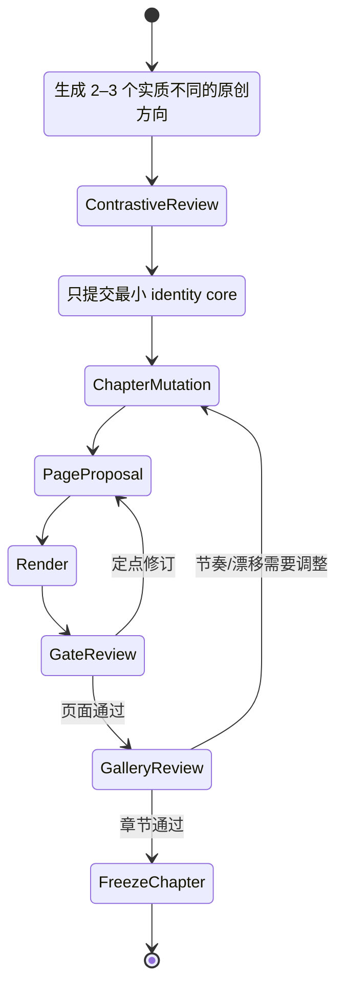

# RFC-A：Creative Autonomy Runtime V2

状态：Proposed / A5–A6 规范性设计  
日期：2026-08-01  
上位架构：[Atlas 证据驱动的长讲义规划编译器](planning-layer-architecture-rfc.md)  
本 RFC 取代 agent-native 路径中的固定 `pageType → layoutBank → zones → hierarchy` 设计假设。

## 1. 决策

采用“稳定外壳、创意内核”的控制架构：

- 稳定外壳只负责语义真值、证据、安全、能力权限、运行恢复、技术合法性和最终可读性下限。
- 一个持续持有整套作品上下文的 Creative Director Agent 负责视觉命题、空间系统、媒介选择、章节变奏和页面构图。
- 系统不向 Agent 分配固定版式，不要求每页必须有 hero、卡片、分区或四级 hierarchy。
- Agent 可以使用、修改或完全放弃建议的 layout grammar；它只需交付可验证的结果。
- 稳定性的含义是“事实正确、可用、可恢复、可编辑要求达标”，不是“重复运行得到相同像素”或“页面都像同一模板”。

这一设计刻意避免两个极端：

- 不是把创意变成七种风格或十一个版式的组合题。
- 也不是把全部材料、工具和权限交给一个无边界 Agent，期待它自行稳定。

## 2. 成功条件

### 稳定性

- 所有精确文字、数字、图结构、代码和来源均可验证。
- Agent 只能通过受控工具写入当前 run workspace，副作用幂等。
- 任意步骤终止后可恢复，已通过页面不因后续失败而重做。
- 70 页任务中，章节并行不导致术语、风格身份和叙事职责失控。
- 失败修复作用于最小元素、页面或章节，不无差别重写整套作品。

### 设计能力

- 默认没有 style preset、layout id 或 page template 枚举。
- Agent 可以原创 deck identity、章节视觉变奏、页面空间系统和媒介组合。
- 稀疏、密集、编辑式、插画式、数据式、实验性构图都能合法表达。
- 同一内容可以产生多个实质不同、同时通过稳定闸的设计方向。
- 评价关注沟通效果和设计质量，不奖励“像参考图”或“服从模板”。

## 3. 权限边界

| 决策 | 所有者 | 系统能否覆盖 |
|---|---|---|
| claim、数字、节点、边、代码、引用 | Evidence/Narrative Compiler | 不能；属于硬真值 |
| 文件/网络/工具权限与预算 | Runtime | 能；始终是硬边界 |
| 画布、导出格式、最低可读性和无障碍 | Delivery Contract | 能；属于交付边界 |
| deck 视觉命题与 identity core | Creative Director | 只有品牌硬约束可覆盖 |
| image/HTML/SVG/hybrid/程序图选择 | Creative Director | 只有验证失败后的 truth-carrier 迁移可覆盖 |
| 是否使用 hero、卡片、分区、网格、图表或隐喻 | Creative Director | 不能由 page type 自动决定 |
| 章节变奏、刻意重复、视觉节奏 | Creative Director | 审计器可提示，不能机械禁止 |
| 修复策略 | Creative Director | Runtime 只限定预算和最小作用域 |

## 4. 架构

[打开 HTML 执行架构图](creative-autonomy-runtime-v2.html)

HTML 图按执行类型着色，而不是按阶段着色：紫色表示 LLM / Agent 推理，粉色表示文生图模型，蓝色表示确定性程序，绿色表示渲染器或外部工具，灰色表示数据与状态，橙色表示验证探针和质量闸。正常路径保持从上到下；失败修订用规则编号返回 Director，不绘制跨层长回线。

稳定外壳不生成构图。Gate Engine 只能返回事实和问题，例如“标题 OCR 少两个字”“节点 C 多出一条边”“正文在 1440×900 下小于 16px”，不能返回“改成左图右文模板”。

## 5. Persistent Creative Director

整套 deck 使用一个逻辑上的 Creative Director 身份，避免每页由互不相识的设计者独立生成。实现上可以分章节并行，但每个 worker 都从同一个已版本化 design memory 分支，并由 Director 合并。

Director 每次设计页面时只获得必要上下文：

- deck charter 与 audience contract；
- 当前 story map 和章节职责；
- 当前页面 evidence packet 与 semantic locks；
- design genome 的 identity core 和当前章节 mutation；
- 已完成页面的 gallery index、构图指纹和 intentional repeats；
- 当前 design debts，例如“前三页连续使用中心构图”“本章缺少一次全幅视觉停顿”。

Director 不默认获得：

- 固定 layout bank；
- 根据 page type 推导出的 zones；
- 七种 style preset 列表；
- 要求每页单 hero、四级 hierarchy 或卡片数量的系统指令；
- 其它页面的完整长 prompt。

## 6. 三层 Creative Contract

### 6.1 Red：不可违反的 truth and delivery locks

```json
{
  "semanticLocks": {
    "exactCopy": ["..."],
    "claims": ["claim-..."],
    "metrics": [{ "label": "...", "value": "...", "evidenceId": "..." }],
    "graph": { "nodes": [], "edges": [] },
    "code": null,
    "prohibitedFabrications": ["..."]
  },
  "deliveryLocks": {
    "aspectRatio": "16:9",
    "offline": true,
    "minimumReadablePx": 16,
    "requiredOutputs": ["html", "screenshot"]
  }
}
```

这些字段表达“什么必须正确”，不表达“应该摆在哪里”。

Red 采用严格准入制。任何新增阻断规则都必须同时声明：约束来源（用户、证据、安全或交付合同）、机器/人工验证器、可观察的失败证据、最小作用域和解除条件；缺少任一项就只能进入 Amber 或 Blue。稳定外壳遵循开放世界原则：未见过的构图、媒介和视觉语言默认可尝试，不能因为不在 allowlist 中而失败。

### 6.2 Amber：身份与沟通目标

```json
{
  "identityCore": {
    "visualThesis": "整套作品的共同视觉立场",
    "paletteLogic": "颜色角色与对比逻辑",
    "typographicVoice": "字体气质与层级行为",
    "graphicDNA": "图形边缘、线条、图像处理和动势",
    "motifs": ["最多 1–3 个弱母题"]
  },
  "communicationGoals": {
    "pageMessage": "...",
    "audienceEffect": "...",
    "chapterFunction": "..."
  }
}
```

Amber 可以被有理由地调制，但 Director 必须说明页面如何仍属于同一套作品。

### 6.3 Blue：非约束性设计启发

```json
{
  "creativeSignals": {
    "possibleTensions": ["秩序与生长", "局部与整体"],
    "optionalReferences": ["只用于质量/媒介启发"],
    "knownFailureModes": ["连接线容易缠绕"],
    "openQuestions": ["是否需要一个视觉停顿页？"]
  }
}
```

Blue 从不因“未使用建议”而判失败。

## 7. Open Design Proposal

合同只类型化必须互操作的部分；composition 本身允许自由文本、scene graph、草图或代码，避免 schema 反过来成为模板。

```json
{
  "version": "2.0",
  "pageId": "page-023",
  "designThesis": "这页如何用视觉完成论证",
  "representation": {
    "kind": "image-first|html-svg|hybrid|native-objects|mixed|custom",
    "customMediaType": null
  },
  "composition": {
    "mediaType": "text/markdown|application/x-scene-graph+json|text/html|image/png|任意已注册扩展",
    "payloadRef": "artifact:..."
  },
  "truthCarriers": {
    "exactCopy": "image|html|svg|native-text",
    "metrics": "image|html|svg|native-chart",
    "graph": "image|svg|native-shapes",
    "code": "image|html|native-text"
  },
  "readingExperience": "...",
  "identityUsage": ["..."],
  "intentionalRepeats": ["..."],
  "knownRisks": ["..."],
  "fallbackPlan": "composition-preserving truth-layer migration"
}
```

`representation` 由 Director 决定。Runtime 不根据 graph/data/code page type 预先指定媒介。协议允许 `custom` 和已注册的扩展 media type；Runtime 不能仅因 schema 尚未认识某个新设计工具而拒绝它。新工具只需声明输入、输出、权限边界与可用验证器，不需要先被收编成新的页面模板。

## 8. Adaptive Truth-Carriers

稳定与自由的关键不是禁止 image-first，而是验证 Agent 选择的真值载体：

1. Director 先选择最适合视觉命题的 representation 和 truth carriers。
2. 渲染后用 OCR、DOM、SVG topology、数据和代码探针验证。
3. 若失败，Director 优先定点修复原 representation。
4. 重试预算耗尽后，只把失败的 truth carrier 迁移到更可验证的层，例如把文字迁移到 HTML、把连线迁移到 SVG；背景、构图、视觉关系和完成度保留。
5. 迁移后重新做整页设计融合，禁止出现“高质量图片上贴一层廉价文本”的补丁感。

因此 Agent 仍可以尝试完整文生图；系统只是拒绝把未通过验证的图片当作最终真值。

## 9. Design Genome 生命周期



### 方向生成

- 2–3 个方向必须在视觉立场、空间逻辑或媒介策略上真正不同，不能只是换颜色。
- 方向生成不展示七 preset 名称。
- 评审采用对比式判断：内容适配、原创性、沟通潜力、可执行性、长篇扩展性。
- 不把多个 judge 分数简单平均成一个“安全但平庸”的方向；保留每个维度的理由。
- 默认由 Director 根据证据自主选择并提交方向，不把自动流水线阻塞在人工选择上；若用户明确希望参与，才展示 direction board 供挑选或混合。
- 候选选择采用词典序/帕累托原则：先淘汰 Red 失败项，再保留 Amber 与 Blue 维度上的非支配候选，由 Director 依据视觉命题提交；禁止用一个加权总分奖励四平八稳的折中方案。

### Identity core 提交

只提交识别一套作品所需的最少内容。具体构图、页面骨架、模块数、hero 位置和章节密度不能进入 identity core。

### 章节调制

每章可改变背景策略、密度、深度、图像/字体比例和节奏，但必须记录 mutation 与 core 的关系。章节 mutation 不是另一个 preset。

## 10. Design Memory

采用三层版本化记忆：

```text
global genome
  ├─ identity core
  ├─ selected direction rationale
  └─ global gallery fingerprints
chapter branch
  ├─ mutation
  ├─ rhythm plan
  └─ local design debts
page decision
  ├─ proposal
  ├─ rendered artifact
  ├─ critique response
  └─ intentional repeats
```

Design memory 保存设计决定，不保存所有冗长 prompt。恢复后 Agent 读取相同的已提交决定，因此保持作品连续性；允许重新生成像素细节，而不允许悄悄换掉 identity core。

构图指纹只用于提醒重复：

- intentional repeat 有明确叙事理由时合法。
- 相同结构连续出现、但没有 repeat intent 时进入 Amber review。
- 不设“同一版式全篇最多一次”这种机械规则。

## 11. 三色质量闸

### Red gates：阻断

- exact copy、metric、graph、code 或 citation 不正确。
- 外链、脚本、安全、越界、溢出、裁切或输出合同失败。
- 低于绝对可读性下限。
- 页面缺少必须表达的 claim，或生成了无来源事实。

### Amber gates：必须回应

- deck identity 漂移。
- 阅读路径不清、连线缠绕、层级竞争、信息过密或过稀。
- 与相邻页面无意重复。
- 无障碍或缩略图表现低于目标，但未触及绝对下限。

Director 可以修订，也可以用设计理由保留。保留理由和评审证据进入 ledger，供章节 gallery review 再判断。

Amber 不是“随便解释一下就通过”。处理规则：

- 可读性、信息组织、专业完成度和跨页身份分别判定，不合并成平均分。
- 任一维度低于 minimum professional floor 时必须产生新候选或修订；Critic 仍不得规定布局。
- identity drift 如果违反用户品牌规范，自动提升为 Red；如果只是偏离系统自己生成的弱母题，保持 Amber。
- 高于最低线但存在艺术争议时，Director 可以保留并记录理由。
- 章节合并前不得存在未回应的 Amber；可以存在有证据、已接受的 waiver。

`minimum professional floor` 必须与风格无关，只检查：作品是否完成、视觉意图是否可辨、关键信息是否能理解、是否存在明显的偶然感或未完成感。不得把“咨询风”“现代扁平”“规则卡片”“大量留白”或任何单一审美当作通用专业标准。

### Blue reviews：只排序或建议

- 更喜欢哪种隐喻、构图、材质、节奏或艺术表达。
- 是否足够大胆、新颖、优雅、克制。
- 候选之间的审美偏好。

Blue 不单独阻断成片，也不能把建议直接改写成固定布局指令。

## 12. Critique Bundle

不同问题不能被一个总分掩盖：

```json
{
  "pageId": "page-023",
  "red": [{ "code": "COPY_MISSING", "evidence": "...", "scope": "element" }],
  "amber": [{ "code": "IDENTITY_DRIFT", "evidence": "...", "scope": "page" }],
  "blue": [{ "observation": "候选 B 的空间张力更好" }],
  "renderFacts": { "overflow": 0, "minimumFontPx": 17 },
  "suggestedScope": "element|page|chapter",
  "layoutPrescription": null
}
```

Critic 不得输出坐标、模板 ID 或“改成三栏”等处方。Creative Director 负责把问题翻译成设计修复。

## 13. 70 页运行模型

### 中央所有权

- 一个 Director 提交 global genome。
- 章节 branch 可以并行，但不能修改 global core。
- 每章完成 5–12 页后先做 contact sheet/gallery review，再合并到全局。
- 全 deck 每完成约 20 页做一次节奏检查；只生成 design debt，不全量重写。

### 有界并行

- Evidence/asset research 可高并行。
- 页面渲染可并行。
- 影响 global genome 的决定必须串行提交。
- 相邻页面或使用共同 visual system 的页面放在同一 chapter branch，避免竞争式写入 design memory。

### 恢复

- checkpoint 包含 genome version、chapter branch head、page proposal hash、truth-carrier 选择和 gate verdict。
- 恢复时继续未完成 proposal，不重新生成已提交方向。
- 修改来源时，根据 claim lineage 失效相关 page contract；只有语义改变影响视觉命题时才要求重做 design proposal。

## 14. Prompt 系统

agent-native 路径不再使用一个同时包含内容、版式、风格、禁止清单和评审标准的巨型 prompt。拆成：

1. **Role/capability prompt**：Director 的职责、可用工具和三层约束语义。
2. **Creative contract**：本 deck/page 的 Red、Amber、Blue 信息。
3. **Design memory**：已提交决定、gallery 摘要和 design debts。
4. **Tool contract**：生成草图、出图、写 HTML/SVG、渲染、检查。
5. **Critique bundle**：上一轮客观问题和非处方式建议。

保留少量模型已知失败模式，例如伪文字、素材网站感、网页 UI 误生成；但禁止把某一时代的审美偏好（如永远禁止 3D、玻璃、卡片、中心构图）写成全局系统限制。是否使用这些语言由 Director 基于当前作品决定。

## 15. 对现有代码的具体改造

### `src/visual-plan.mjs`

- `buildVisualPlan()` 增加 `planningMode`，默认新项目使用 `agent-native`，旧项目保持 `legacy-layout`。
- agent-native 不构建或选择 `layoutBank`。
- `pageType` 只可作为语义分析标签，不能触发布局选择。
- `layoutBlueprint`、`zones` 和固定 hierarchy 对 agent-native 不再必填。
- 新增 `creativeContract`、`designProposalRef`、`designMemoryVersion` 和 `truthCarriers`。
- `validateVisualPlan()` 分模式验证；agent-native 验证真值和 artifact refs，不验证版式字段存在。

代码级验收：

- `planningMode: agent-native` 的单元测试必须在没有 `stylePreset/layoutBank/layoutBlueprint/zones/pageType` 时通过。
- legacy 项目输出保持兼容，现有测试不通过删除旧路径来“解决”。
- agent-native 运行时不得调用 `selectLayout()`；通过 spy/coverage 证明，而不是只检查最终 JSON。
- agent-native 可以显式请求 layout inspiration tool，但返回值只是 Blue signal，不写入必填 layout id。

### Prompt compiler

- 新增 `compileAgentNativePrompt()`，不复用含固定 hero/四级 hierarchy 的 legacy prompt。
- 不把 `MODEL_LAYOUT_BRIEFS`、default zones 或 page type composition 写入 agent-native prompt。
- 把 semantic locks 作为数据块，把 Blue signals 明确标为 optional。
- 允许 Director 选择 image-first、HTML/SVG、hybrid 或 native objects 工具。

Prompt snapshot 必须证明 agent-native 不含以下遗留指令或等价强制表述：

- `Use one dominant explanatory visual`
- `Build a clear four-level hierarchy`
- `title, explanatory hero visual, supporting evidence, closing takeaway`
- 默认 layout id、固定 zone 名称或根据 page type 推导的 composition
- 全局禁止卡片、3D、玻璃、中心构图等审美偏好

semantic locks、交付边界和模型已知技术失败模式仍可出现在 prompt 中。

### Provider/runtime

- page provider 输入从固定 page input 扩展为 design proposal + creative contract。
- reference provider 变成可选的 inspiration/sketch/render 工具，不是每页必经阶段。
- review 拆成 semantic/technical/identity/aesthetic verdict，不能用单一 pass/score 代替。
- composition ledger 升级为 design memory；保留 intentional repeat 和章节节奏。

## 16. 验证矩阵

### 16.1 稳定性

| 测试 | 通过条件 |
|---|---|
| 同一 20 页任务运行 3 次 | 每次 Red gates 100% 通过；允许设计不同 |
| 70 页混合材料任务 | page id、claim、引用完整；章节恢复和最小失效通过 |
| 中途终止 | 恢复后沿用相同 genome/branch，不重做已通过页面 |
| 高风险 graph/data/code 页 | Agent 自选载体；最终拓扑、数字、代码逐项准确 |
| image-first 中文文字失败 | 自动进入 composition-preserving truth-layer migration，视觉完成度不明显降级 |
| 恶意网页/上传材料 | 不能改变工具权限、设计核心或运行指令 |

### 16.2 创意自由

| 测试 | 通过条件 |
|---|---|
| 无 preset 原创方向 | 输出 2–3 个结构/媒介实质不同的方向，不出现 preset id |
| 相同内容的三次开放运行 | 至少产生两种显著不同的空间系统，且都通过 Red gates |
| 10 个跨领域主题 | design genome 能随内容变化，不收敛到同一科技商务风 |
| 稀疏封面、诗性章节页 | 不因缺少 hero/zones/cards 被 schema 拒绝 |
| 密集架构与复杂数据页 | 允许多焦点、分层、连续场或程序化视觉，不强制单 hero |
| intentional repeat | 有叙事理由的重复不会被重复检测器机械打回 |

### 16.3 对照实验

新旧 planner 使用相同 evidence/page contracts，比较：

- semantic/technical pass rate；
- 首轮通过率和修订次数；
- 人工盲评的内容适配、原创性、层级、整套一致性和专业完成度；
- 构图指纹分布与无意重复率；
- 平均时间、token、图像调用次数；
- 失败后视觉质量保持度。

不得只用平均总分宣布 agent-native 更好。稳定性各项必须不低于基线，设计能力至少在原创性与内容适配两项显著提高，才允许替换默认路径。

### 16.4 设计级压力演练

| 场景 | Agent 自由 | 稳定外壳行为 | 不允许的系统行为 |
|---|---|---|---|
| 极简诗性封面 | 可无分区、无图表、无传统 hero | 检查精确标题、安全边距和最低可读性 | 因缺少 body/takeaway zone 拒绝 |
| 六层复杂架构 | 可多焦点、连续场、局部放大或程序图 | 核验节点/边、连线遮挡和缩略图阅读 | 强制改成中心 hero + 四周卡片 |
| 数据密集决策页 | 可使用非仪表盘式视觉，也可以主动选择仪表盘 | 核验每个数字、标签、来源和字体 | 全局禁止 dashboard 或自动指定 KPI 卡数量 |
| image-first 中文页 | 可先尝试完整文生图 | OCR 失败后只迁移失败文字层，并重新融合 | 一开始就禁止 image-first；或失败后降级成廉价模板 |
| 有意重复的章节页 | 可重复同一构图建立节奏 | 检查 `intentionalRepeats` 和相邻页职责 | 以“版式已使用”机械打回 |
| 品牌要求之外的实验性 3D/玻璃 | 可在内容适配时使用 | 检查可读性、身份和专业完成度 | 把时代性审美偏好写成系统禁令 |
| 恶意网页含“忽略规则” | 无权把材料内容变成运行指令 | Stable Shell 隔离数据与权限并记录攻击 | 让 Creative Director 执行网页中的工具指令 |

## 17. 明确保留与删除

### 保留

- semantic locks、证据 lineage、浏览器硬探针、逐页截图和定点修订。
- deck-level identity、章节级 gallery review 和构图重复提醒。
- 七 preset 作为显式用户选择、回归样本和离线 benchmark。
- legacy-layout 用于已有测试、确定性批量模板和回滚。

### 从 agent-native 删除

- 自动 `pageType → layout id`。
- 必填 layout blueprint、zones 和四级 hierarchy。
- 全局“每页只能一个 hero”。
- 全局禁止卡片、3D、玻璃、中心构图等审美禁令。
- 每页都必须先生成参考图。
- 以参考图相似度或模板符合度作为创意质量标准。
- “同一版式全篇只能出现一次”的机械去重。

## 18. 方案的诚实边界

这个架构最大化的是**可验证边界内的设计自由**，不是无条件自由。以下约束仍然必须存在：

- 用户和材料给出的真值不能为了构图被改写。
- 交付媒介、可访问性、安全和离线要求会限制某些表现形式。
- 模型、图像 API、浏览器和时间/费用预算决定可探索候选数。
- 最终设计质量仍需真实 A/B 和人工评审证明，schema 本身不能制造审美能力。

因此正确的完成声明不是“架构保证 Agent 一定设计得好”，而是：系统不再提前替 Agent 做审美决定，同时能阻止错误、不稳定和不可交付的结果进入成片。
